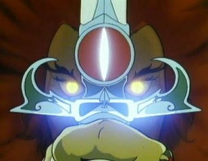

A. Huaman Quispe
================

:email: ahuaman3@gatech.edu	
:project: Fitting segmented pointclouds to superquadrics online
:mentor: Marco Gutierrez
 
About me     
--------  

+------------------------------------------------------+------------------------------------------------------+
| I am a GSoC participant who wants to bestow robots   | |sn_se|                                              | 
| with the powers of *Sight Beyond Sight* to perceive  |                                                      |
| objects in their environment and to perform useful   |                                                      |
| manipulation tasks with them.                        |                                                      |
+------------------------------------------------------+------------------------------------------------------+ 
 

About the project   
-----------------

Our goal is to provide PCL with a module to fit superellipsoids to segmented,
one-view pointclouds in an online manner.

 
Recent status updates
---------------------
    
.. blogbody::  
  :author: ahuaman
  :nr_posts: 5  
  
 
 
.. .. .. .. .. .. .. .. .. .. .. .. .. .. .. .. .. .. .. .. .. .. .. .. 

.. toctree::
  :hidden:

  status
  
