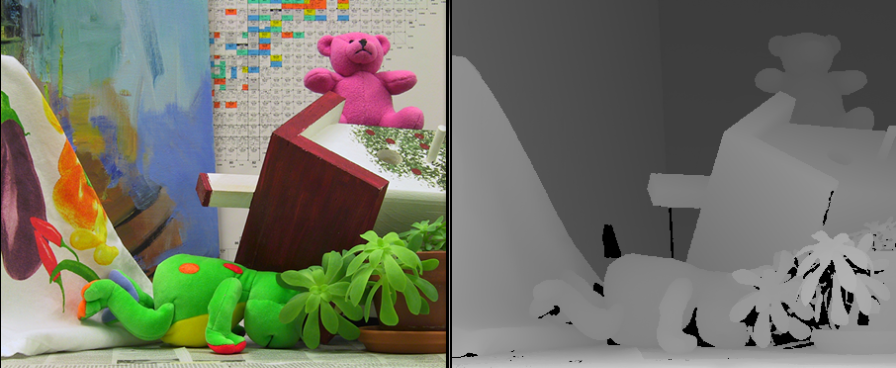

.. blogpost::
   :title: 2. Implementation of local-based approach for stereo matching
   :author: jilliam
   :date: 28-06-2014

In this post, I will briefly describe the current state of the stereo module and the new features added.

Currently, the stereo module encompass two matching local-based algorithms:
1. Block-based algorithm, which is programed using the Box-Filtering algorithm proposed in [McDonnell81]_. 
2. Adaptive Cost 2-pass Scanline Optimization, presented in [Wang06]_.
Both methods use the Sum of Absolute Differences (SAD) as the dissimilarity measure.

As mentioned in the previous blog, the first objective of the present project is to implement the local-based approach proposed in [Min1]_, for dense correspondence estimation in a pair of grayscale rectified images with an efficient cost aggregation step. Additionally, the cost aggregation step in based on the method presented in [Yoon06]_, where the weighting function uses a similarity measure based on the color and spatial distances.

In order to do so, a new class CompactRepresentationStereoMatching was created in the stereo module. This class inherits from class GrayStereoMatching, which in turns inherits from class StereoMatching, since some pre and post-processing methods are re-implemented. 
The new class has five member functions with public access: setRadius, set FilterRadius and setNumDispCandidates, setGammaS, setGammaC, which set three data members of type int (radius_, filter_radius_ and num_disp_candidates_) and two of type double (gamma_c_ and gamma_s_) with private access, as well as implementing the virtual method compute_impl.

radius_ corresponds to the radius of the cost aggregation window, with default value equal to 5.

filter_radius_ corresponds to the radius of the box filter used for the computation of the likelihood function. The default value is 5.

num_disp_candidates_ is the number of the subset of the disparity hypotheses used for the cost aggregation. The default value is 60.

gamma_c_ is the spatial bandwidth used for cost aggregation based on adaptive weights. The default value is 15.

gamma_s_ is the color bandwidth used for cost aggregation based on adaptive weights. The default value is 25.

Similarly to the previous methods, the current class is based on the SAD matching function, and it estimates the per-pixel cost efficiently using the Box-Filtering algorithm.

To test the algorithm, the Middlebury stereo benchmark (http://vision.middlebury.edu/stereo/) dataset is going to be used.

.. [McDonnell81] McDonnell, M. J. "Box-filtering techniques". Computer Graphics and Image Processing 17.1, 65-70, 1981.

.. [Wang06] Wang, Liang, et al. "High-quality real-time stereo using adaptive cost aggregation and dynamic programming." 3D Data Processing, Visualization, and Transmission, Third International Symposium on. IEEE, 2006.

.. [Yoon06] K.-J. Yoon and I.-S. Kweon. “Locally Adaptive Support-Weight Approach for Visual Correspondence Search”. In Proceedings of Conference on Computer Vision and Pattern Recognition (CVPR), 924–931, 2005.

