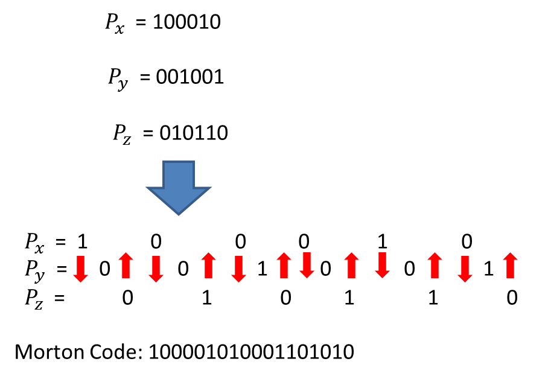
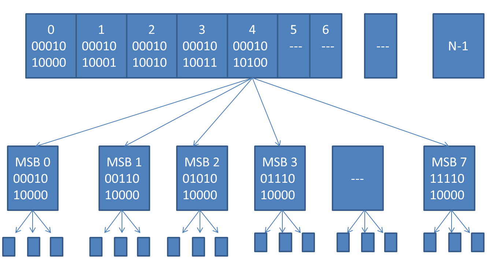

My status updates
=================

.. blogbody::
  :nr_days: 60
  :author: anurag

.. blogpost::
  :title: Test post
  :author: anurag
  :date: 08-08-2014

      * **Introduction**

Point cloud library (PCL) is a collection of algorithms which can be used from simple computer vision applications (filtering, object recognition) to highly computationally expensive machine learning applications. PCL is used today in various fields like robotics, gaming, entertainment, computer vision, medical etc. PCL is cross-platform library, and can be used from Desktop to mobile platforms. To simplify development, PCL is separated into several modules like filtering, features, registration etc. These modules have algorithms which are computationally expensive and from them real time performance is required.

OpenCL Module for PCL is one among the others attempt which are trying to increase the user productivity by increasing real time performance of algorithms. The goal of this GSOC Project is to optimize PCL modules using OpenCL so that these optimized modules can be used on various heterogeneous platforms.

For implementing an OpenCL algorithm, we have to allocate the memory to device, run the kernel and get back the results from device to host. We have implemented a common platform Utils inside OCL module which can be used by different algorithms for memory allocation and running the kernel. Utils also take care of different point types of PCL library. For different point type we are not able to define structure for all point types inside OpenCL kernel. This module takes the point type as an argument and allocates memory according to that and removes the necessity of defining structure inside kernel.   

The most important two modules which are used mostly inside PCL library are filtering and searching. During this summer we have optimized some filtering algorithms and wrote the whole octree based searching method using OpenCL which is used in almost all PCL modules. We have also optimized the tracking library which uses particle filtering based tracker to track the object and heavily depends on searching and filtering modules.

* **Searching Module** 

There are two known methods for optimizing octree building and searching. One is Bottom to top approach and another is Top-Down approach. Both of these methods are dependent on Space Filling Curves (Morton Codes). Morton Codes simplify the problem by representing the 3D points in single format (Morton code). It first chooses the order in which the leaf nodes (each corresponding to one object) appear in the tree, and then generating the internal nodes in a way that respects this order. We generally want objects that located close to each other in 3D space to also reside nearby in the hierarchy, so a reasonable choice is to sort them along a space-filling curve.

We have used Top-Down approach in our implementation because it is faster than Bottom to Top approach and easy to implement on heterogeneous devices. The octree building is divided into following steps:

1). **Morton Code Generation:** The space filling curve is defined in terms of Morton codes. To calculate a Morton code for the given 3D point, we start by looking at the binary fixed-point representation of its coordinates, as shown in Figure 1. First, we convert the floating point coordinates into 10 bit integer coordinate. Then we expand each coordinate inserting two “gaps” after each bit, after that, we interleave the bits of all three coordinates together to form a single binary number. If we step through the Morton codes obtained this way in increasing order, we are effectively stepping along the Z-order curve in 3D which is also called octree (a 2D representation is shown on the right-hand side of the Figure 1). In practice, we can determine the order of the leaf nodes by assigning a Morton code for each object and then sorting the objects accordingly. 

**Figure1: Morton Code Generation**

2). **Sorting:** For sorting the Morton codes we have used bitonic sorting algorithm. Sorting is used to separate the different Morton codes based on their levels.

3). **Octree Building:** For octree building we have used spatial clustering based method. After Morton coding of x, y, z coordinates each coordinate is represented by single number and each three bits represents one level of octree. After bitonic sorting, we first partition the whole range based on their most significant bits (MSB) starting from range 0 to 7. By this approach, we found the clusters of numbers which have the same MSB which logically represent the spatially neighbor coordinate. After this, we partition each cluster next to their MSB bits. We repeat this until we come to last level or we have least number of leaves left at the end. The highest level of tree which has all the clusters called root node and its partitioned are called nodes. The nodes at the last level are called child nodes and intermediate levels called parent nodes. In this approach, we start from root nodes and then move to leaf nodes that why it is called Top-Down Approach.                                  

**Figure2:Top-Down Approach with highest level with sorted root node and lower level clustered nodes.**

* **Octree Searching:**
We have implemented point based Approximate nearest search, Radius search and brute force search which search the points in the octree. Next target is to implement this searching on cloud of points in parallel.

* **Filtering Module:** In filtering module lot of algorithms depends on octree based searching which can be optimized by using parallel octree based implementation. We have also optimized some algorithms like median filter; pass through filter, Nan Removal, Convolution, min-max calculation etc. which are not dependent on octree.   

* **Tracking Module:**  We have optimized particle filtering based tracking inside tracking module. Particle filtering based mostly depends on filtering and searching so we have used optimized filtering and searching. For searching we added PCL search module inside tracking module and added octree method inside it. We have also optimized point based coherence methods like RGBtoHSV conversion and bounding box calculation inside PCL. 

