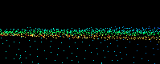
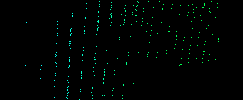
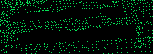

Alexandru-Eugen Ichim
=====================

:email: alex.e.ichim@gmail.com
:project: Surface reconstruction and point cloud smoothing

About me
--------
I am currently pursuing a Master's degree in Computer Science at the Swiss Federal Institute of Technology Lausanne (EPFL), working
as a student research assistant for the Computer Graphics and Geometry Laboratory, headed by Prof. Mark Pauly.

Apart from my interests in Computer Graphics, I have an affinity for Robotics, as during my undergraduate studies I have
worked for the Robotics Group at Jacobs University, Bremen, supervised by Prof. Andreas Birk.

My first contact with the PCL project was done via the Google Summer of Code program. My contributions are succinctly listed
in the `developer blog <http://www.pointclouds.org/gsoc/aichim/index.php>`_ I have written during the 2011 summer.

For more details about my work (and much more), please visit my `personal website <http://www.alexichim.com>`_

Problem Description
-------------------
In the past months, immense advances have been made in 3D perception by the introduction of cheap 3D cameras developed
by PrimeSense in the form of the Microsoft Kinect or the Asus Xtion Pro Live. The affordability of these sensors launched
a revolution in terms of the amount of hobbyists, engineers and researchers interested in studying the possibilities opened.

Unfortunately, this affordability comes with the price of very poor data quality. As compared to their more expensive
counterparts (e.g., time-of-flight cameras based on laser sensing), the RGB-D cameras present numerous issues that restrict
their utilisation in applications that need more precision. This is caused by artifacts such as:

* high level of noise in both the depth and color images

		
* quantization artifacts

* missing pixels

* various color image distortions

The goal of this project is to analyze the various methods available for improving the quality of the data delivered by
the Kinect-like sensors. The approach we shall take is to first understand the behavior of these sensors and then look into
previous work that has been done for point cloud smoothing, especially in the Computer Graphics community (who have been
treating this problem years before the launch of the new generation of RGB-D cameras).

Tentative list of publications to be looked into:

* Marton, Zoltan Csaba and Rusu, Radu Bogdan and Beetz, Michael - On fast surface reconstruction methods for large and noisy point clouds, Proceedings of the 2009 IEEE international conference on Robotics and Automation
* Novatnack, John and Nishino, Ko - Scale-Dependent/Invariant Local 3D Shape Descriptors for Fully Automatic Registration of Multiple Sets of Range Images, Proceedings of the 10th European Conference on Computer Vision: Part III
* John Novatnack and Ko Nishino - Scale-Dependent 3D Geometric Features, Scale-Dependent 3D Geometric Features
* Avron, Haim and Sharf, Andrei and Greif, Chen and Cohen-Or, Daniel - L1-Sparse reconstruction of sharp point set surfaces, ACM Trans. Graph.
* Nina Amenta - Defining point-set surfaces, ACM Trans. Graph
* Zwicker, Matthias and Pauly, Mark and Knoll, Oliver and Gross, Markus - Pointshop 3D: an interactive system for point-based surface editing, Proceedings of the 29th annual conference on Computer graphics and interactive techniques
* Weyrich, T. and Pauly, M. and Heinzle, S. and Scandella, S. and Gross, M. - Post-processing of Scanned 3D Surface Data, Symposium On Point-Based Graphics

Roadmap
-------
Surface reconstruction and point cloud smoothing project planning, as part of the PCL Toyota Code Sprint.

* try out some simple smoothing mechanisms by using the Kinect:	

 * static camera and static scene
 * simple temporal smoothing
 * simple neighborhood smoothing
 * Moving Least Squares smoothing
 * add change detection		
 * this should give us an understanding of the problems we are facing - need spatial or temporal filtering or both? in what conditions?
 
* benchmark smoothing algorithms that have been already implemented in open-source products such as `MeshLab <http://meshlab.sourceforge.net/>`_ or `Pointshop3D <http://graphics.ethz.ch/pointshop3d/>`_	
* improve the virtual_scanner tool in PCL:

 * noise and Kinect-like discretization artifacts
 * GUI with enhanced user interaction
 
* improve the basic mesh representation structures currently present in PCL. A viable option would be a wrapper around a library such as `OpenMesh <http://www.openmesh.org/>`_ or similar
* in order to be able to use edge-aware smoothing algorithms, robust edge detection algorithms are needed: implement the 3DGSS features (`info <https://www.cs.drexel.edu/~kon/3DGSS/>`_)
* look into the possibilities of real-time smoothing (such as the Kinect Fusion project) or try a more "heavy-duty" approach of improving the quality of the clouds by an offline procedure based on feature-based registration and ICP pose refinement
* very important: come up with a benchmarking approach for evaluating the results on real sensor data.

Datasets
--------

As part of the Toyota Code Sprint, a comprehensive set of indoor scenes were required. Please go :ref:`here <aichim_datasets>` for a detailed presentation of each dataset.

Recent status updates
---------------------

.. blogbody::
   :author: aichim
   :nr_posts: 35

.. .. .. .. .. .. .. .. .. .. .. .. .. .. .. .. .. .. .. .. .. .. .. .. 

.. toctree::
   :hidden:

   datasets
   status
